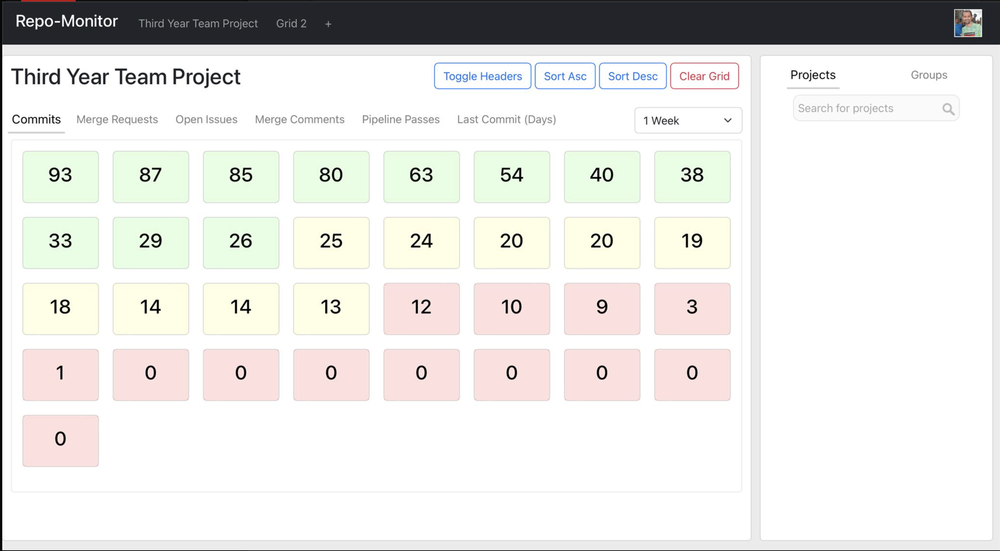

<div align="center">
  <h1>Repo-Monitor</h1>
</div>

Repo-Monitor is a web-application designed to streamline the process of monitoring progress on repositories. Repo-Monitor provides a Grid View, to which multiple different repositories can be added, and a range of metrics viewed on them. The application is deployed on a UofG server at [luzon.dcs.gla.ac.uk](http://luzon.dcs.gla.ac.uk) (Note: requires connection to UofG network to access)

<figure class="image" align="center">


<figcaption>A Screenshot of Repo-Monitor showing a grid of repositories</figcaption>
</figure>

## Technologies

Repo-Monitor is built using React JS. It uses the GitLab REST API to gather data on repositories. Documentation for the API can be found [here](https://docs.gitlab.com/ee/api/api_resources.html)


## Run Instructions

As Repo-Monitor is built with [React JS](https://reactjs.org), it uses Node Package Manager (npm). In order to run this, you will need to install [Node js](https://nodejs.org/en/).

### Instructions
Firstly, clone this repository and navigate to its folder:
```
$ git clone git@github.com:Aidanddow/individual-project.git
$ cd individual-project/repo-monitor
```

Then install the projects dependencies with:
```
$ npm install
```

The server can then be run using:
```
$ npm start
```

The application will now be up and running on [localhost:3000](http://localhost:3000)


### Production Build
An optimised production build can be created using
```
$ npm run build
```

### Testing
The automated unit tests for the application can be run using: 
```
$ npm test
```